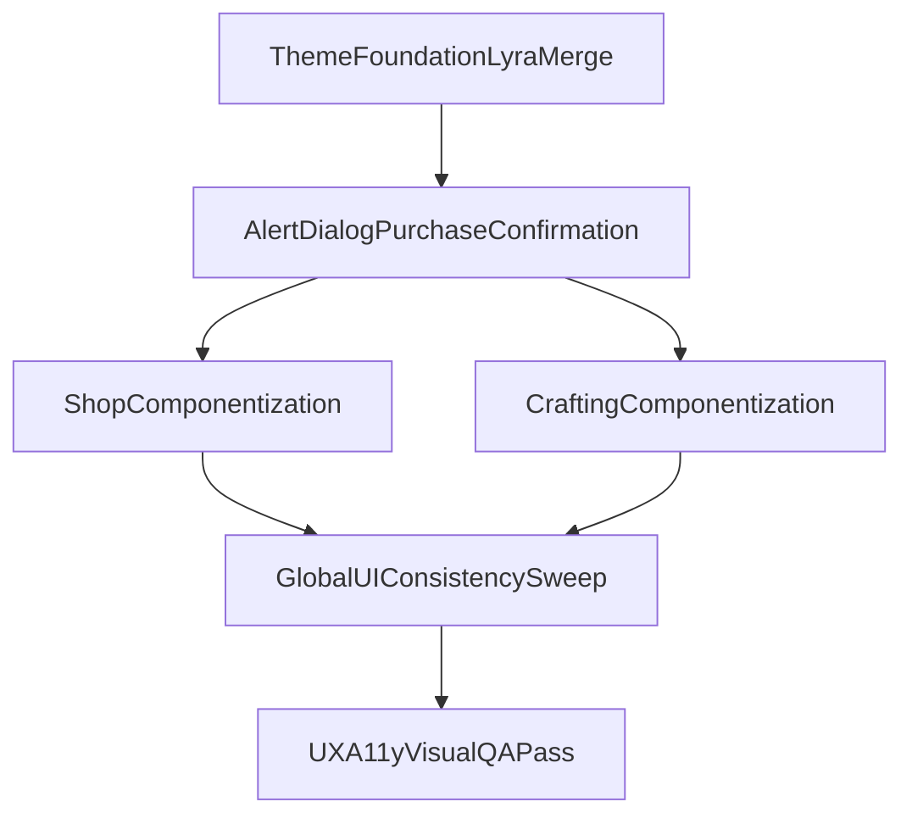

# Plano de Implementação: Tema Dark Fantasy + Base Lyra

## Objetivo
- Corrigir o modal de confirmação de compra para aderir ao padrão visual/UX do sistema.
- Fazer varredura completa do app para unificar design tokens, componentes e padrões de interação.
- Adotar Lyra como fundação via merge controlado, preservando identidade dark fantasy e oferecendo versão clara coesa.

## Escopo confirmado
- Varredura completa do app.
- Adoção de Lyra em modo **merge controlado** (sem overwrite agressivo).

## Fase 1 — Fundação do tema (tokens, preset, governança)
- Revisar e ajustar a base em [components.json](c:/Projects/workspace/tower-trials-next/components.json), [tailwind.config.ts](c:/Projects/workspace/tower-trials-next/tailwind.config.ts) e [src/app/globals.css](c:/Projects/workspace/tower-trials-next/src/app/globals.css).
- Aplicar Lyra como fundação e mapear tokens semânticos para paleta dark fantasy premium (dark principal + light correspondente).
- Definir contrato de tema:
  - tokens semânticos obrigatórios (`background`, `foreground`, `card`, `primary`, `muted`, `accent`, `border`, `ring`);
  - tokens de domínio (batalha/raridade) sem hardcode por componente;
  - proibição de cores utilitárias hardcoded em componentes de produto.
- Reduzir `globals.css` para fundação (tokens + utilitários globais mínimos), movendo estilos de feature para componentes/variants.

## Fase 2 — Correção do modal de confirmação e overlays
- Substituir o fluxo de confirmação custom por padrão shadcn acessível:
  - migrar [src/components/core/confirmation-modal.tsx](c:/Projects/workspace/tower-trials-next/src/components/core/confirmation-modal.tsx) para composição `AlertDialog`;
  - remover dependência visual/estrutural de [src/components/core/animated-modal.tsx](c:/Projects/workspace/tower-trials-next/src/components/core/animated-modal.tsx) para confirmação de compra.
- Garantir consistência de actions primária/secundária/destrutiva, foco, teclado, contraste e estados disabled/loading.

## Fase 3 — Componentização de Shop/Crafting (alto impacto visual)
- Refatorar [src/components/shop/ShopLayout.tsx](c:/Projects/workspace/tower-trials-next/src/components/shop/ShopLayout.tsx):
  - extrair `ShopItemCard`, `ShopFilterGroup`, `RequirementRow`, `StatPill`, `ItemDetailSection`;
  - substituir classes hardcoded (`slate/*`, `red/*`, etc.) por tokens e variants.
- Refatorar [src/app/(authenticated)/(tabs)/game/crafting/page.tsx](c:/Projects/workspace/tower-trials-next/src/app/(authenticated)/(tabs)/game/crafting/page.tsx):
  - extrair bloco duplicado de comparação (`248-281`) para componente reutilizável de comparação/equipamento;
  - centralizar mapeamentos de raridade/tipo/ícone em util compartilhado de UI.
- Unificar linguagem visual e microinterações entre shop e crafting.

## Fase 4 — Varredura global de consistência do app
- Auditar componentes base em `src/components/ui/*` e `src/components/core/*` para aderência semântica (tokens/variants/cn).
- Eliminar overrides de cor/tipografia em `className` quando o componente já deve encapsular estilo.
- Padronizar iconografia, espaçamento, estados e feedbacks (empty/loading/error/success).

## Fase 5 — UX/A11y e performance visual
- Validar acessibilidade: foco visível, contraste, navegação por teclado, hierarquia de headings/dialog title.
- Revisar motion e efeitos para manter tema premium sem excesso (animações utilitárias e previsíveis).
- Verificar responsividade em breakpoints críticos (shop/crafting/modais).

## Fluxo alvo

## Critérios de pronto
- Modal de confirmação de compra visualmente aderente ao design system e acessível.
- Tema dark fantasy premium consolidado com versão clara coerente.
- Shop/Crafting sem blocos duplicados críticos e com componentes reutilizáveis.
- Componentes do app aderentes a tokens semânticos/variants (sem hardcode de paleta em escala ampla).
- Sem novos erros de lint/types e sem regressões funcionais em compra/crafting/batalha.