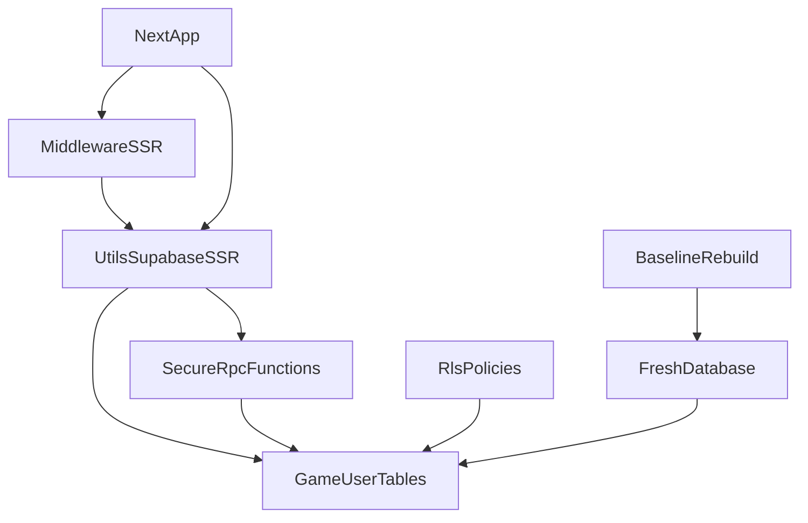

# Plano de implementação para atualização Supabase + segurança

## 1) Atualizar integração Supabase (seguindo o prompt literal)
- Instalar/atualizar dependências com `npm install @supabase/supabase-js @supabase/ssr` (o projeto já possui as libs, então confirmar versão final e lockfile).
- Criar os helpers no padrão novo:
  - [src/utils/supabase/client.ts](src/utils/supabase/client.ts)
  - [src/utils/supabase/server.ts](src/utils/supabase/server.ts)
  - [src/utils/supabase/middleware.ts](src/utils/supabase/middleware.ts)
- Criar `middleware` raiz compatível com sessão SSR atualizada, ajustando [src/middleware.ts](src/middleware.ts) para usar o novo helper e manter regras de roteamento/autorização já existentes.
- Adicionar/alinhar variáveis em `.env.local` no formato do prompt (`NEXT_PUBLIC_SUPABASE_URL`, `NEXT_PUBLIC_SUPABASE_PUBLISHABLE_KEY`) sem quebrar a base atual.
- Mapear e migrar uso de [src/lib/supabase.ts](src/lib/supabase.ts) para os novos helpers; manter compatibilidade temporária com fallback para evitar regressão em massa.

## 2) Compatibilidade com arquitetura atual
- Ajustar [src/config/env.ts](src/config/env.ts) para aceitar o novo nome de chave (`NEXT_PUBLIC_SUPABASE_PUBLISHABLE_KEY`) em paralelo ao legado (`NEXT_PUBLIC_SUPABASE_ANON_KEY`) durante transição.
- Planejar depreciação controlada de [src/lib/supabase.ts](src/lib/supabase.ts):
  - manter exportações necessárias enquanto consumidores são migrados;
  - remover `createServerClientHelper` baseado em `createBrowserClient` no middleware (inadequado para sessão SSR robusta).

## 3) Hardening imediato de segredos e superfície de ataque
- Remover exposição pública de `service_role` (hoje existe `NEXT_PUBLIC_SERVICE_ROLE` em runtime e `.env`), migrando para variável server-only (ex.: `SUPABASE_SERVICE_ROLE_KEY`) e restringindo uso exclusivamente no servidor.
- Revisar todos os pontos que importam `supabaseAdmin` para garantir execução apenas server-side e sem vazamento em bundles client.
- Padronizar obtenção de sessão no middleware para evitar bypass por cookies desserializados fora do fluxo recomendado de `@supabase/ssr`.

## 4) Validar migração de XP/pontos de atributo
- Revisar [supabase/migrations/20241220000007_fix_secure_grant_xp_attribute_points_per_level.sql](supabase/migrations/20241220000007_fix_secure_grant_xp_attribute_points_per_level.sql) frente às funções anteriores e ao histórico de migrações de `secure_grant_xp`.
- Confirmar se a regra de pontos por múltiplos level-ups está correta e idempotente.
- Verificar regressões de segurança/consistência na função (ex.: validação anti-cheat de XP por chamada, limites máximos, logs, nível cap).
- Se necessário, criar migração complementar de correção em vez de editar migração histórica já aplicada.

## 5) Planejamento de revisão RLS + anti-abuso (baseado no cenário atual)
- Inventariar tabelas críticas de usuário/personagem/jogo e status de RLS/policies nas migrações (characters, users, inventários, equipamentos, magias, progressão, logs e tabelas de ranking/drops).
- Definir matriz de acesso por role (`anon`, `authenticated`, `service_role`) com princípio de menor privilégio.
- Planejar políticas por domínio:
  - dados de conta e personagem: acesso apenas ao próprio `auth.uid()`;
  - escrita de progresso sensível: somente via RPC `SECURITY DEFINER` validada;
  - tabelas de catálogo do jogo: leitura pública controlada, sem escrita direta.
- Endurecer funções `SECURITY DEFINER` com:
  - schema privado para funções privilegiadas;
  - validações de input/range/frequência;
  - bloqueios de manipulação direta de XP/gold/floor fora das funções seguras;
  - auditoria de operações sensíveis.
- Revisar grants/revokes para impedir acesso acidental por `PUBLIC` em objetos sensíveis.

## 6) Verificação e rollout
- Verificação técnica:
  - tipagem/lint/build;
  - smoke de login/session refresh SSR;
  - smoke de fluxo crítico (batalha, ganho de XP, distribuição de pontos).
- Verificação de segurança:
  - checklist de segredos expostos;
  - tentativa de acesso cruzado entre usuários via query direta;
  - tentativa de update direto em tabelas sensíveis bloqueada por RLS.
- Rollout em fases:
  - fase 1: integração SSR/middleware + segredo server-only;
  - fase 2: políticas RLS e grants;
  - fase 3: cleanup legado (`src/lib/supabase.ts` e variáveis antigas) após estabilidade.

## 7) Fase adicional: reset completo do banco + rebaseline de migrações
- Objetivo: reduzir dívida técnica de migrações acumuladas e subir um banco novo, consistente e mais auditável.
- Estratégia segura:
  - tirar backup completo (schema + dados críticos) e snapshot operacional;
  - congelar mudanças de schema durante a janela de consolidação;
  - classificar dados em:
    - preservados (usuários, progresso essencial, inventário/equipamento relevantes);
    - descartáveis/regeneráveis (logs transitórios, dados de teste e caches);
  - preparar plano de rollback (restauração integral em caso de falha).
- Entregáveis da consolidação:
  - baseline única inicial contendo tabelas, índices, constraints, triggers e funções finais;
  - pacote de migrações incrementais mínimas pós-baseline;
  - remoção/arquivamento de migrações obsoletas redundantes.
- Regras de qualidade para baseline:
  - toda tabela exposta com RLS habilitado e policies mínimas por role;
  - funções privilegiadas em schema privado e `SECURITY DEFINER` somente quando necessário;
  - grants/revokes explícitos sem permissões implícitas para `PUBLIC`;
  - validações anti-cheat preservadas (XP/gold/floor/consumo).

## 8) Bootstrap do banco limpo e validação pós-reset
- Subir um banco novo a partir da baseline consolidada.
- Reaplicar seeds controladas e catálogos de jogo.
- Executar suite de validação:
  - integridade de schema e funções RPC críticas;
  - autenticação/sessão SSR;
  - fluxo de batalha, XP, level-up e distribuição de atributos;
  - verificação de isolamento de dados entre usuários (RLS).
- Critério de go-live:
  - nenhum bloqueador de segurança, regressão funcional crítica ou inconsistência de progressão.

