# Diagrama de Relacionamentos do Banco de Dados - Tower Trials

## Visão Geral

Este documento apresenta o diagrama ER (Entity-Relationship) completo do banco de dados Tower Trials, mostrando todos os relacionamentos entre as tabelas.

---

## 🗺️ Diagrama ER Completo (Mermaid)

```mermaid
erDiagram
    %% ==================== CORE SYSTEM ====================

    users ||--o{ characters : "possui"
    users ||--o{ dead_characters : "possui"
    users ||--o{ game_rankings : "tem"
    users ||--o{ game_progress : "tem"

    %% ==================== CHARACTER SYSTEM ====================

    characters ||--o{ character_equipment : "possui"
    characters ||--o{ character_consumables : "possui"
    characters ||--o{ character_drops : "possui"
    characters ||--o{ potion_slots : "tem"
    characters ||--o{ spell_slots : "tem"

    %% ==================== EQUIPMENT SYSTEM ====================

    equipment ||--o{ character_equipment : "está em"
    equipment ||--o{ equipment_crafting_recipes : "resultado de"
    equipment ||--o{ equipment_crafting_ingredients : "usado em"

    equipment_crafting_recipes ||--o{ equipment_crafting_ingredients : "requer"

    %% ==================== CONSUMABLES SYSTEM ====================

    consumables ||--o{ character_consumables : "está em"
    consumables ||--o{ potion_slots : "equipado em"
    consumables ||--o{ crafting_recipes : "resultado de"
    consumables ||--o{ crafting_ingredients : "usado em"

    crafting_recipes ||--o{ crafting_ingredients : "requer"

    %% ==================== DROPS & MONSTERS ====================

    monster_drops ||--o{ character_drops : "está em"
    monster_drops ||--o{ monster_possible_drops : "dropado por"
    monster_drops ||--o{ crafting_ingredients : "usado em"
    monster_drops ||--o{ equipment_crafting_ingredients : "usado em"

    monsters ||--o{ monster_possible_drops : "dropa"

    %% ==================== SPELLS ====================

    spells ||--o{ spell_slots : "equipado em"

    %% ==================== EVENTS & FLOORS ====================

    floors }o--o{ monsters : "contém (via monster_pool)"

    %% ==================== TABLE DEFINITIONS ====================

    users {
        bigserial id PK
        uuid uid UK
        varchar username UK
        varchar email UK
        varchar display_name
        text avatar_url
        varchar role
        integer highest_floor
        integer total_games
        integer total_victories
        integer total_character_level
        integer max_character_slots
        varchar telefone
        varchar documento
        varchar tipo_pessoa
        date data_nascimento
        boolean is_active
        timestamptz last_login
        timestamptz created_at
        timestamptz updated_at
    }

    characters {
        uuid id PK
        uuid user_id FK
        varchar name
        integer level
        integer xp
        integer xp_next_level
        integer gold
        integer floor
        integer highest_floor
        integer hp
        integer max_hp
        integer mana
        integer max_mana
        integer atk
        integer def
        integer speed
        integer strength
        integer dexterity
        integer intelligence
        integer wisdom
        integer vitality
        integer luck
        integer attribute_points
        integer sword_mastery
        integer axe_mastery
        integer blunt_mastery
        integer defense_mastery
        integer magic_mastery
        integer sword_mastery_xp
        integer axe_mastery_xp
        integer blunt_mastery_xp
        integer defense_mastery_xp
        integer magic_mastery_xp
        timestamptz last_activity
        timestamptz created_at
        timestamptz updated_at
    }

    dead_characters {
        uuid id PK
        uuid user_id FK
        uuid original_character_id
        varchar name
        integer level
        bigint xp
        bigint gold
        integer strength
        integer dexterity
        integer intelligence
        integer wisdom
        integer vitality
        integer luck
        integer max_hp
        integer max_mana
        integer atk
        integer def
        integer speed
        integer floor_reached
        integer highest_floor
        integer total_monsters_killed
        bigint total_damage_dealt
        bigint total_damage_taken
        integer total_spells_cast
        integer total_potions_used
        varchar death_cause
        varchar killed_by_monster
        timestamptz character_created_at
        timestamptz died_at
        integer survival_time_minutes
        timestamptz created_at
        timestamptz updated_at
    }

    equipment {
        uuid id PK
        varchar name
        text description
        equipment_type type
        weapon_subtype weapon_subtype
        equipment_rarity rarity
        integer level_requirement
        integer strength_bonus
        integer dexterity_bonus
        integer intelligence_bonus
        integer wisdom_bonus
        integer vitality_bonus
        integer luck_bonus
        integer atk_bonus
        integer def_bonus
        integer mana_bonus
        integer speed_bonus
        integer hp_bonus
        decimal critical_chance_bonus
        decimal critical_damage_bonus
        integer strength_penalty
        integer dexterity_penalty
        integer intelligence_penalty
        integer wisdom_penalty
        integer vitality_penalty
        integer luck_penalty
        integer speed_penalty
        integer price
        boolean is_unlocked
        boolean craftable
        timestamptz created_at
        timestamptz updated_at
    }

    character_equipment {
        uuid id PK
        uuid character_id FK
        uuid equipment_id FK
        boolean is_equipped
        timestamptz created_at
        timestamptz updated_at
    }

    consumables {
        uuid id PK
        varchar name
        text description
        varchar type
        integer effect_value
        integer price
        integer level_requirement
        boolean craftable
        timestamptz created_at
        timestamptz updated_at
    }

    character_consumables {
        uuid id PK
        uuid character_id FK
        uuid consumable_id FK
        integer quantity
        timestamptz created_at
        timestamptz updated_at
    }

    potion_slots {
        uuid id PK
        uuid character_id FK
        integer slot_position
        uuid consumable_id FK
        timestamptz created_at
        timestamptz updated_at
    }

    spells {
        uuid id PK
        varchar name
        text description
        spell_effect_type effect_type
        integer mana_cost
        integer cooldown
        integer unlocked_at_level
        integer effect_value
        integer duration
        timestamptz created_at
        timestamptz updated_at
    }

    spell_slots {
        uuid id PK
        uuid character_id FK
        integer slot_position
        uuid spell_id FK
        timestamptz created_at
        timestamptz updated_at
    }

    monsters {
        uuid id PK
        varchar name
        integer hp
        integer atk
        integer def
        integer mana
        integer speed
        monster_behavior behavior
        integer min_floor
        integer reward_xp
        integer reward_gold
        integer strength
        integer dexterity
        integer intelligence
        integer wisdom
        integer vitality
        integer luck
        decimal critical_chance
        decimal critical_damage
        decimal critical_resistance
        decimal physical_resistance
        decimal magical_resistance
        decimal debuff_resistance
        decimal physical_vulnerability
        decimal magical_vulnerability
        monster_trait primary_trait
        monster_trait secondary_trait
        text[] special_abilities
        timestamptz created_at
        timestamptz updated_at
    }

    monster_drops {
        uuid id PK
        varchar name
        text description
        varchar rarity
        integer value
        timestamptz created_at
        timestamptz updated_at
    }

    monster_possible_drops {
        uuid id PK
        uuid monster_id FK
        uuid drop_id FK
        double_precision drop_chance
        integer min_quantity
        integer max_quantity
        timestamptz created_at
        timestamptz updated_at
    }

    character_drops {
        uuid id PK
        uuid character_id FK
        uuid drop_id FK
        integer quantity
        timestamptz created_at
        timestamptz updated_at
    }

    crafting_recipes {
        uuid id PK
        uuid result_id FK
        varchar name
        timestamptz created_at
        timestamptz updated_at
    }

    crafting_ingredients {
        uuid id PK
        uuid recipe_id FK
        uuid item_id
        varchar item_type
        integer quantity
        timestamptz created_at
        timestamptz updated_at
    }

    equipment_crafting_recipes {
        uuid id PK
        uuid result_equipment_id FK
        varchar name
        text description
        timestamptz created_at
        timestamptz updated_at
    }

    equipment_crafting_ingredients {
        uuid id PK
        uuid recipe_id FK
        uuid item_id
        varchar item_type
        integer quantity
        timestamptz created_at
        timestamptz updated_at
    }

    floors {
        integer floor_number PK
        floor_type type
        uuid[] monster_pool
        boolean is_checkpoint
        integer min_level
        text description
        timestamptz created_at
        timestamptz updated_at
    }

    special_events {
        uuid id PK
        varchar name
        special_event_type type
        text description
        integer hp_restore_percent
        integer mana_restore_percent
        integer gold_reward_min
        integer gold_reward_max
        integer chance_weight
        integer min_floor
        timestamptz created_at
        timestamptz updated_at
    }

    game_rankings {
        uuid id PK
        varchar player_name
        integer highest_floor
        uuid user_id FK
        integer character_level
        integer character_gold
        boolean character_alive
        timestamptz created_at
    }

    game_progress {
        uuid id PK
        uuid user_id FK
        varchar player_name
        integer current_floor
        integer hp
        integer max_hp
        integer attack
        integer defense
        integer highest_floor
        timestamptz created_at
        timestamptz updated_at
    }
```



---

## 📊 Tipos de Relacionamentos

### **1:N (One-to-Many)**

#### users → characters

- Um usuário pode ter **múltiplos personagens**
- Cada personagem pertence a **um único usuário**
- Cascade: DELETE on users → deletes all characters

#### users → dead_characters

- Um usuário pode ter **múltiplos personagens mortos**
- Cada registro de morte pertence a **um único usuário**
- Cascade: DELETE on users → deletes all dead_characters

#### characters → character_equipment

- Um personagem pode ter **múltiplos equipamentos**
- Cada entrada de equipamento pertence a **um único personagem**
- Cascade: DELETE on character → deletes all equipment entries

#### characters → potion_slots

- Um personagem tem **exatamente 3 slots de poção**
- Cada slot pertence a **um único personagem**
- Cascade: DELETE on character → deletes all potion slots

#### characters → spell_slots

- Um personagem tem **exatamente 3 slots de spell**
- Cada slot pertence a **um único personagem**
- Cascade: DELETE on character → deletes all spell slots

#### monsters → monster_possible_drops

- Um monstro pode ter **múltiplos drops possíveis**
- Cada configuração de drop pertence a **um único monstro**
- Cascade: DELETE on monster → deletes all drop configurations

#### crafting_recipes → crafting_ingredients

- Uma receita requer **múltiplos ingredientes**
- Cada ingrediente pertence a **uma única receita**
- Cascade: DELETE on recipe → deletes all ingredients

---

### **N:M (Many-to-Many) - Via Tabela de Junção**

#### characters ↔ equipment

- **Tabela de junção**: `character_equipment`
- Um personagem pode ter múltiplos equipamentos
- Um equipamento pode estar no inventário de múltiplos personagens
- Campo adicional: `is_equipped` (indica se está equipado ou apenas no inventário)

#### characters ↔ consumables

- **Tabela de junção**: `character_consumables`
- Um personagem pode ter múltiplos consumíveis
- Um consumível pode estar no inventário de múltiplos personagens
- Campo adicional: `quantity` (quantidade no inventário)

#### characters ↔ monster_drops

- **Tabela de junção**: `character_drops`
- Um personagem pode ter múltiplos drops
- Um drop pode estar no inventário de múltiplos personagens
- Campo adicional: `quantity` (quantidade no inventário)

#### monsters ↔ monster_drops

- **Tabela de junção**: `monster_possible_drops`
- Um monstro pode dropar múltiplos itens
- Um item pode ser dropado por múltiplos monstros
- Campos adicionais: `drop_chance`, `min_quantity`, `max_quantity`

---

### **1:1 ou 0:1 (One-to-One Optional)**

#### potion_slots → consumables

- Um slot pode ter **um consumível** ou **nenhum** (NULL)
- Referência: `ON DELETE SET NULL`

#### spell_slots → spells

- Um slot pode ter **uma spell** ou **nenhuma** (NULL)
- Referência: `ON DELETE SET NULL`

---

## 🔗 Foreign Keys e Constraints

### Cascade Rules

#### ON DELETE CASCADE

- `characters.user_id` → `users.uid`
- `character_equipment.character_id` → `characters.id`
- `character_consumables.character_id` → `characters.id`
- `character_drops.character_id` → `characters.id`
- `potion_slots.character_id` → `characters.id`
- `spell_slots.character_id` → `characters.id`
- `monster_possible_drops.monster_id` → `monsters.id`
- `crafting_ingredients.recipe_id` → `crafting_recipes.id`
- `equipment_crafting_ingredients.recipe_id` → `equipment_crafting_recipes.id`

#### ON DELETE SET NULL

- `game_rankings.user_id` → `users.uid`
- `potion_slots.consumable_id` → `consumables.id`
- `spell_slots.spell_id` → `spells.id`

#### Unique Constraints

- `characters(user_id, name)` - Usuário não pode ter dois personagens com mesmo nome
- `character_equipment(character_id, equipment_id)` - Personagem não pode ter duplicatas do mesmo equipamento na mesma entrada
- `character_consumables(character_id, consumable_id)` - Um registro por consumível (usa quantity)
- `character_drops(character_id, drop_id)` - Um registro por drop (usa quantity)
- `potion_slots(character_id, slot_position)` - Slot único por posição
- `spell_slots(character_id, slot_position)` - Slot único por posição

---

## 🎯 Relacionamentos Especiais

### Polimórficos (Type-based)

#### crafting_ingredients

- `item_id` + `item_type` formam uma referência polimórfica
- `item_type IN ('monster_drop', 'consumable')`
- Se `item_type = 'monster_drop'` → `item_id` referencia `monster_drops.id`
- Se `item_type = 'consumable'` → `item_id` referencia `consumables.id`

#### equipment_crafting_ingredients

- `item_id` + `item_type` formam uma referência polimórfica
- `item_type IN ('monster_drop', 'consumable', 'equipment')`
- Se `item_type = 'monster_drop'` → `item_id` referencia `monster_drops.id`
- Se `item_type = 'consumable'` → `item_id` referencia `consumables.id`
- Se `item_type = 'equipment'` → `item_id` referencia `equipment.id`

### Array References

#### floors.monster_pool

- Array de UUIDs (`UUID[]`)
- Cada UUID referencia um monstro em `monsters.id`
- Não há constraint de FK real (PostgreSQL não suporta FK em arrays)
- Validação feita em nível de aplicação

---

## 🔄 Fluxo de Dados Principais

### Criação de Personagem

```
1. User cria account → users
2. User cria character → characters
3. Sistema cria 3 potion_slots (vazios)
4. Sistema cria 3 spell_slots (vazios)
5. Sistema atualiza users.total_character_level
6. Sistema atualiza users.max_character_slots (se desbloqueado)
```

### Morte de Personagem (Permadeath)

```
1. Character HP ≤ 0 em combate
2. Sistema copia dados para dead_characters
3. Sistema deleta character
   → CASCADE: deleta character_equipment
   → CASCADE: deleta character_consumables
   → CASCADE: deleta character_drops
   → CASCADE: deleta potion_slots
   → CASCADE: deleta spell_slots
4. Sistema atualiza users.total_character_level
5. Sistema atualiza users.max_character_slots (pode perder slots)
```

### Combate e Loot

```
1. Character derrota monster
2. Sistema roda RNG em monster_possible_drops
3. Para cada drop sorteado:
   → Sistema adiciona/atualiza character_drops (quantity)
4. Sistema adiciona reward_xp → characters.xp
5. Sistema adiciona reward_gold → characters.gold
6. Sistema atualiza last_activity → characters.last_activity
```

### Crafting de Consumíveis

```
1. User seleciona crafting_recipe
2. Sistema verifica crafting_ingredients
3. Para cada ingredient:
   → Se item_type='monster_drop': verifica character_drops.quantity
   → Se item_type='consumable': verifica character_consumables.quantity
4. Se tem todos: consome ingredientes
5. Sistema adiciona result (consumable) ao inventário
```

### Crafting de Equipamentos

```
1. User seleciona equipment_crafting_recipe
2. Sistema verifica equipment_crafting_ingredients
3. Para cada ingredient:
   → Se item_type='monster_drop': verifica character_drops.quantity
   → Se item_type='consumable': verifica character_consumables.quantity
   → Se item_type='equipment': verifica character_equipment (não equipado)
4. Se tem todos: consome ingredientes (deleta registros)
5. Sistema adiciona result (equipment) ao inventário
```

---

## 📝 Notas de Implementação

### Consistência Referencial

- **Sempre respeitada** via Foreign Keys
- **Exceção**: `floors.monster_pool` (array de UUIDs) - validação em aplicação

### Integridade de Dados

- Triggers: `update_updated_at_column()` em todas as tabelas mutáveis
- Checks: Validações em tipo ENUM, ranges numéricos
- Unique Constraints: Previnem duplicatas lógicas

### Performance

- Índices criados em todas as Foreign Keys
- Índices adicionais em campos de ordenação (level, floor, died_at, etc)
- Índices compostos em pares (character_id, slot_position)

### Segurança

- RLS habilitado em todas as tabelas sensíveis
- Políticas garantem acesso apenas a dados próprios
- Tabelas de referência (equipment, consumables, spells) com leitura pública
- SECURITY DEFINER em funções que precisam bypass de RLS

---

## 🔍 Consultas Comuns

### Buscar inventário completo de um personagem

```sql
-- Equipamentos
SELECT e.* FROM character_equipment ce
JOIN equipment e ON ce.equipment_id = e.id
WHERE ce.character_id = :character_id;

-- Consumíveis
SELECT c.*, cc.quantity FROM character_consumables cc
JOIN consumables c ON cc.consumable_id = c.id
WHERE cc.character_id = :character_id;

-- Drops
SELECT md.*, cd.quantity FROM character_drops cd
JOIN monster_drops md ON cd.drop_id = md.id
WHERE cd.character_id = :character_id;
```

### Buscar slots de um personagem

```sql
-- Potion Slots
SELECT ps.slot_position, c.* FROM potion_slots ps
LEFT JOIN consumables c ON ps.consumable_id = c.id
WHERE ps.character_id = :character_id
ORDER BY ps.slot_position;

-- Spell Slots
SELECT ss.slot_position, s.* FROM spell_slots ss
LEFT JOIN spells s ON ss.spell_id = s.id
WHERE ss.character_id = :character_id
ORDER BY ss.slot_position;
```

### Buscar drops possíveis de um monstro

```sql
SELECT md.*, mpd.drop_chance, mpd.min_quantity, mpd.max_quantity
FROM monster_possible_drops mpd
JOIN monster_drops md ON mpd.drop_id = md.id
WHERE mpd.monster_id = :monster_id;
```

---

## ✅ Próximos Passos

- [ ] Documentar todas as funções RPC em `DB_FUNCTIONS_CATALOG.md`
- [ ] Extrair constantes de balanceamento em `GAME_BALANCE_CONSTANTS.md`
- [ ] Criar diagramas de fluxo para operações críticas
