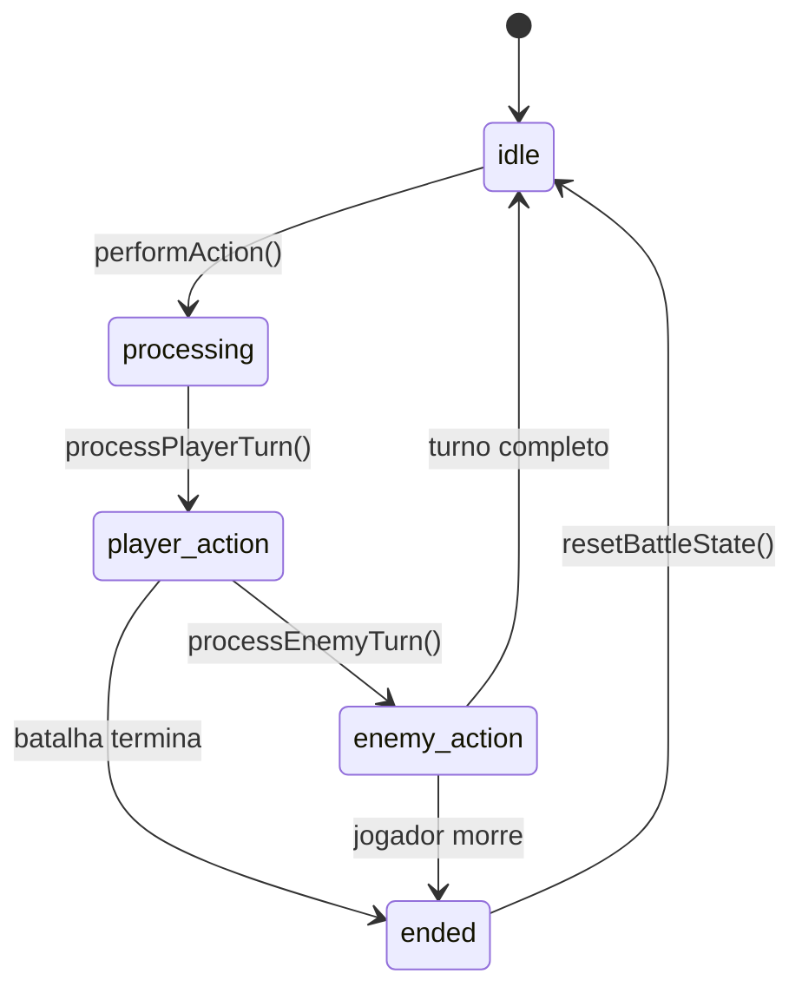

# Migração do Battle System para Zustand

## Resumo da Migração

O `BattleProvider` foi migrado para um store Zustand moderno (`useBattleStore`) que oferece melhor performance, controle de estado e separação de responsabilidades.

### **Benefícios da Migração**

✅ **Performance**: Seletores granulares evitam re-renders desnecessários  
✅ **Arquitetura**: Separação clara entre estado e ações  
✅ **Debounce**: Controle robusto de ações duplicadas  
✅ **DevTools**: Integração nativa com Redux DevTools  
✅ **TypeScript**: Type safety completo  
✅ **Modularidade**: Hooks especializados para diferentes aspectos

---

## **Arquitetura do BattleStore**

### **Estados Gerenciados**

```tsx
interface BattleState {
  // === CONTROLE DE AÇÕES ===
  isProcessingAction: boolean; // Ação em progresso?
  lastActionTimestamp: number; // Timestamp da última ação
  lastAction: string; // Última ação executada

  // === ESTADOS DE BATALHA ===
  currentTurnType: 'player' | 'enemy' | 'waiting' | null;
  battlePhase: 'idle' | 'player_action' | 'enemy_action' | 'processing' | 'ended';
  currentBattleId: string | null; // ID da batalha atual
  turnCount: number; // Contador de turnos

  // === FEEDBACK VISUAL ===
  showPlayerActionFeedback: boolean; // Mostrar feedback da ação do jogador
  showEnemyActionFeedback: boolean; // Mostrar feedback da ação do inimigo
  lastPlayerActionMessage: string; // Última mensagem do jogador
  lastEnemyActionMessage: string; // Última mensagem do inimigo

  // === CONTROLE DE SEQUÊNCIA ===
  actionQueue: Array<{
    // Fila de ações (futuro)
    id: string;
    action: ActionType;
    spellId?: string;
    consumableId?: string;
    timestamp: number;
  }>;
}
```

### **Responsabilidades por Função**

| **Função**            | **Responsabilidade**       | **Integração**                  |
| --------------------- | -------------------------- | ------------------------------- |
| `performAction()`     | Orquestrar ação completa   | GameStateStore + CharacterStore |
| `processPlayerTurn()` | Processar turno do jogador | GameService + CharacterService  |
| `processEnemyTurn()`  | Processar turno do inimigo | GameService + CharacterService  |
| `startBattle()`       | Inicializar batalha        | Automático via useBattleManager |
| `endBattle()`         | Finalizar batalha          | GameStateStore                  |

---

## **Padrões de Uso**

### **1. Hook Integrado (Recomendado)**

```tsx
import { useBattleManager } from '@/stores/useBattleStore';

function BattleScreen() {
  const { battleState, isInBattle, currentBattleId } = useBattleManager();

  // Batalha é automaticamente inicializada/finalizada
  if (!isInBattle) return <div>Não há batalha ativa</div>;

  const handleAttack = () => {
    battleState.performAction('attack');
  };

  return (
    <div>
      <h2>Batalha ID: {currentBattleId}</h2>
      <p>Turno: {battleState.turnCount}</p>
      <button onClick={handleAttack} disabled={battleState.isProcessingAction}>
        Atacar
      </button>
    </div>
  );
}
```

### **2. Seletores Especializados (Performance)**

```tsx
import { useBattleState, useBattleActions, useBattleFeedback } from '@/stores/useBattleStore';

function BattleActions() {
  // Só re-renderiza quando estado de batalha muda
  const { isProcessingAction, currentTurnType, battlePhase } = useBattleState();
  const { performAction } = useBattleActions();

  return (
    <div className={`battle-phase-${battlePhase}`}>
      <button
        onClick={() => performAction('attack')}
        disabled={isProcessingAction || currentTurnType !== 'player'}
      >
        Atacar {isProcessingAction && '...'}
      </button>
    </div>
  );
}

function BattleFeedback() {
  // Só re-renderiza quando feedback muda
  const {
    showPlayerActionFeedback,
    showEnemyActionFeedback,
    lastPlayerActionMessage,
    lastEnemyActionMessage,
  } = useBattleFeedback();

  return (
    <div className="battle-feedback">
      {showPlayerActionFeedback && <div className="player-action">{lastPlayerActionMessage}</div>}
      {showEnemyActionFeedback && <div className="enemy-action">{lastEnemyActionMessage}</div>}
    </div>
  );
}
```

### **3. Acesso Direto ao Store (Máximo Controle)**

```tsx
import { useBattleStore } from '@/stores/useBattleStore';

function AdvancedBattleComponent() {
  const battleStore = useBattleStore();

  // Acesso direto a tudo
  const canPerformAction =
    !battleStore.isProcessingAction && battleStore.currentTurnType === 'player';

  const handleSpellCast = (spellId: string) => {
    if (!canPerformAction) return;
    battleStore.performAction('cast_spell', spellId);
  };

  return (
    <div>
      <p>Fase: {battleStore.battlePhase}</p>
      <p>Turnos: {battleStore.turnCount}</p>
      {/* Interface complexa */}
    </div>
  );
}
```

---

## **Controle de Debounce e Performance**

### **Sistema de Debounce Robusto**

```tsx
// Validações automáticas no performAction:
- Mesmo tipo de ação: 2000ms de intervalo mínimo
- Qualquer ação: 500ms de intervalo mínimo
- Bloqueia se já está processando
- Bloqueia se personagem morto (gameover)
```

### **Evitando Re-renders**

```tsx
// ❌ RUIM: Re-renderiza sempre que qualquer coisa muda
const battleStore = useBattleStore();

// ✅ BOM: Re-renderiza só quando dados específicos mudam
const { isProcessingAction } = useBattleState();
const { performAction } = useBattleActions();

// ✅ ÓTIMO: Seletor customizado
const isPlayerTurn = useBattleStore(
  state => state.currentTurnType === 'player' && !state.isProcessingAction
);
```

---

## **Integração com Outros Stores**

### **Fluxo de Dados Unidirecional**

```
BattleStore ──► GameStateStore ──► UI
     │               │
     └──► CharacterStore ─────┘
```

### **Comunicação entre Stores**

```tsx
// BattleStore coordena, outros stores executam
const performAction = async (action) => {
  const gameStateStore = useGameStateStore.getState();
  const characterStore = useCharacterStore.getState();

  // 1. Processar ação
  const result = await GameService.processPlayerAction(action, gameStateStore.gameState);

  // 2. Atualizar estados externos
  gameStateStore.setGameState(result.newState);

  // 3. Aplicar efeitos colaterais
  if (result.skillXpGains) {
    await CharacterService.addSkillXp(characterStore.selectedCharacter.id, ...);
  }

  // 4. Controlar próximo turno
  if (result.shouldProcessEnemyTurn) {
    await processEnemyTurn();
  }
};
```

---

## **Efeitos Colaterais e Separação de Responsabilidades**

### **O que NÃO vai no Store**

❌ **Sons e Música**

```tsx
// EM VEZ DE: dentro do store
set(state => {
  state.playSound = true;
});

// FAÇA: componente observa e reage
function BattleSounds() {
  const { battlePhase, showPlayerActionFeedback } = useBattleFeedback();

  useEffect(() => {
    if (showPlayerActionFeedback) {
      AudioManager.playSound('player-action');
    }
  }, [showPlayerActionFeedback]);

  useEffect(() => {
    if (battlePhase === 'enemy_action') {
      AudioManager.playSound('enemy-turn');
    }
  }, [battlePhase]);
}
```

❌ **Animações e Efeitos Visuais**

```tsx
// EM VEZ DE: controlar animações no store

// FAÇA: componente reage aos estados do store
function BattleAnimations() {
  const { showEnemyActionFeedback, lastEnemyActionMessage } = useBattleFeedback();

  return (
    <AnimatePresence>
      {showEnemyActionFeedback && (
        <motion.div
          initial={{ opacity: 0, y: -50 }}
          animate={{ opacity: 1, y: 0 }}
          exit={{ opacity: 0, y: 50 }}
          className="enemy-damage-text"
        >
          {lastEnemyActionMessage}
        </motion.div>
      )}
    </AnimatePresence>
  );
}
```

❌ **Navegação e Rotas**

```tsx
// EM VEZ DE: dentro do store
if (gameState.mode === 'gameover') {
  router.push('/character-death');
}

// FAÇA: componente observa e navega
function BattleNavigationManager() {
  const gameState = useGameStateStore(state => state.gameState);
  const router = useRouter();

  useEffect(() => {
    if (gameState.mode === 'gameover') {
      router.push('/character-death');
    } else if (gameState.mode === 'victory') {
      router.push('/victory-screen');
    }
  }, [gameState.mode, router]);

  return null; // Componente só para efeitos colaterais
}
```

### **O que VAI no Store**

✅ **Estados de Interface**

```tsx
// Estados que afetam como a UI é renderizada
state.showPlayerActionFeedback = true;
state.battlePhase = 'player_action';
state.isProcessingAction = false;
```

✅ **Lógica de Negócio**

```tsx
// Regras do jogo e validações
if (action === 'flee' && newState.fleeSuccessful) {
  get().endBattle();
  return;
}
```

✅ **Controle de Fluxo**

```tsx
// Coordenação entre turnos e fases
setTimeout(() => {
  get().processEnemyTurn(action, action === 'defend');
}, 1000);
```

---

## **Ciclo de Vida da Batalha**

### **Diagrama de Estados**



### **Fluxo de Turno Detalhado**

```tsx
// 1. VALIDAÇÕES (performAction)
if (!selectedCharacter) return;
if (isProcessingAction) return;
if (gameState.mode === 'gameover') return;
if (debounce não passou) return;

// 2. MARCAR COMO PROCESSANDO
set(draft => {
  draft.isProcessingAction = true;
  draft.battlePhase = 'processing';
});

// 3. PROCESSAR TURNO DO JOGADOR
await processPlayerTurn(action);
  └── GameService.processPlayerAction()
  └── Aplicar XP e efeitos
  └── Verificar condições especiais (fuga, morte, vitória)
  └── Se necessário: setTimeout(() => processEnemyTurn())

// 4. PROCESSAR TURNO DO INIMIGO (se aplicável)
await processEnemyTurn(playerAction, playerDefended);
  └── GameService.processEnemyActionWithDelay()
  └── Aplicar dano/efeitos no jogador
  └── Verificar se jogador morreu
  └── Retornar turno ao jogador

// 5. FINALIZAR BATALLA
endBattle();
  └── Limpar estados de processamento
  └── Atualizar GameStateStore
  └── Delay para limpar feedback visual
```

---

## **Exemplo Completo de Implementação**

```tsx
// components/BattleSystem.tsx
import { useBattleManager, useBattleState, useBattleActions } from '@/stores/useBattleStore';
import { useGameStateStore } from '@/stores/useGameStateStore';

export function BattleSystem() {
  const { isInBattle } = useBattleManager();

  if (!isInBattle) return null;

  return (
    <div className="battle-container">
      <BattleInterface />
      <BattleFeedback />
      <BattleSounds />
      <BattleAnimations />
    </div>
  );
}

function BattleInterface() {
  const { isProcessingAction, currentTurnType } = useBattleState();
  const { performAction } = useBattleActions();
  const enemy = useGameStateStore(state => state.gameState.currentEnemy);

  const canAct = !isProcessingAction && currentTurnType === 'player';

  return (
    <div className="battle-interface">
      <div className="enemy-info">
        <h3>{enemy?.name}</h3>
        <div className="health-bar">
          <div className="health-fill" style={{ width: `${(enemy?.hp / enemy?.maxHp) * 100}%` }} />
        </div>
      </div>

      <div className="battle-actions">
        <button onClick={() => performAction('attack')} disabled={!canAct}>
          Atacar
        </button>
        <button onClick={() => performAction('defend')} disabled={!canAct}>
          Defender
        </button>
        <button onClick={() => performAction('flee')} disabled={!canAct}>
          Fugir
        </button>
      </div>

      {isProcessingAction && <div className="processing-indicator">Processando ação...</div>}
    </div>
  );
}

// App.tsx - Setup principal
function App() {
  return (
    <div className="app">
      <BattleSystem />
      {/* Outros componentes */}
    </div>
  );
}
```

---

## **Migração do Código Existente**

### **Antes (Context API)**

```tsx
// ❌ Padrão antigo
const { performAction } = useContext(BattleContext);
const { gameState } = useGameState();
const { selectedCharacter } = useCharacter();

// Sem controle granular de re-renders
```

### **Depois (Zustand)**

```tsx
// ✅ Padrão novo
const { performAction } = useBattleActions();
const { isProcessingAction } = useBattleState();
const gameState = useGameStateStore(state => state.gameState);

// Re-renders otimizados e seletores específicos
```

### **Checklist de Migração**

- [ ] Substituir `useContext(BattleContext)` por `useBattleActions()`
- [ ] Migrar estados visuais para `useBattleFeedback()`
- [ ] Implementar `useBattleManager()` para ciclo de vida automático
- [ ] Separar efeitos colaterais (sons, animações) em componentes observadores
- [ ] Testar debounce e validações de turno
- [ ] Verificar integração com GameStateStore e CharacterStore

---

## **Performance e Observabilidade**

### **Redux DevTools**

O store usa `subscribeWithSelector` e está integrado automaticamente com Redux DevTools:

```tsx
// Ações aparecem no DevTools como:
-'BattleStore/performAction' - 'BattleStore/processPlayerTurn' - 'BattleStore/endBattle';
```

### **Logs Estruturados**

```tsx
// Logs automáticos no console:
[BattleStore] === PROCESSANDO AÇÃO: attack ===
[BattleStore] Processando turno do jogador: attack
[BattleStore] === INICIANDO TURNO DO INIMIGO ===
[BattleStore] Finalizando batalha
```

### **Métricas de Performance**

```tsx
// Seletores otimizados evitam re-renders:
const battleStats = useBattleStore(state => ({
  turnCount: state.turnCount,
  battleId: state.currentBattleId,
  phase: state.battlePhase,
}));

// Só re-renderiza quando esses 3 campos específicos mudam
```

A migração mantém **100% da funcionalidade original** mas com arquitetura moderna, performática e muito mais fácil de usar e manter!
