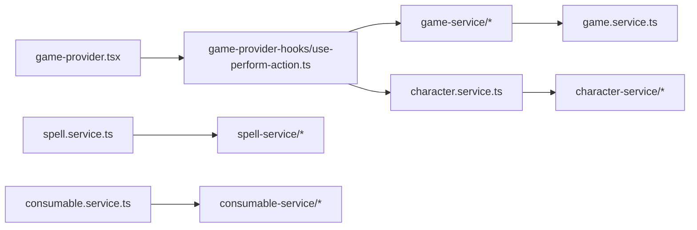

# Fluxo de batalha (core loop)

## Visão geral

1. **Entrada**: [`selectCharacter`](../../src/resources/game/game-provider.tsx) monta `GameState` em `mode: 'battle'`, com `currentFloor`, `currentEnemy` e jogador vindo de `CharacterService.getCharacterForGame`.
2. **Ação do jogador**: UI chama `performAction(action, spellId?, consumableId?)` no contexto.
3. **Resolução**: [`GameService.processPlayerAction`](../../src/resources/game/game.service.ts) devolve `newState`, `skipTurn`, mensagens e opcionalmente skill XP.
4. **Vitória**: se `currentEnemy.hp <= 0`, o provider chama `processEnemyDefeat` e preenche `battleRewards`.
5. **Turno inimigo**: após ação que não encerra o combate, o provider agenda `processEnemyActionWithDelay`, atualiza HP/mana no banco e devolve o turno ao jogador.
6. **Avançar andar**: com `battleRewards` definido, `performAction('continue')` chama `advanceToNextFloor` (persiste `floor`, novo inimigo).

## Invariantes úteis

- Em combate ativo: `mode === 'battle'` e `currentEnemy` não nulo (exceto transições muito curtas controladas pelo provider).
- `performAction` é um **mutex de turno** (`loading.performAction`): serve para desabilitar botões, **não** para desmontar a página de batalha.

## Arquivos principais

| Peça | Arquivo |
|------|---------|
| Estado global | `game-provider.tsx` |
| Regras de dano / turno | `game.service.ts` |
| UI combate | `game-battle.tsx`, `CombinedBattleInterface.tsx` |

## Mapa de módulos (refatoração)

